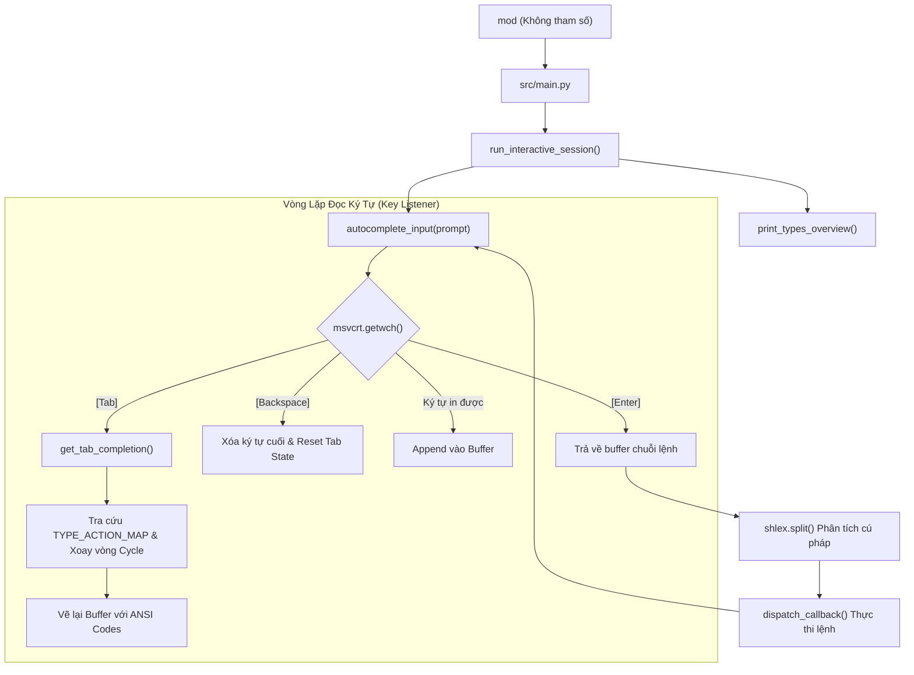

# ⌨️ Tài Liệu Chi Tiết Tính Năng Auto-Complete Trong Mod CLI

Tính năng **Auto-complete (Tự động hoàn thành & Xoay vòng lệnh)** trong Mod CLI được tích hợp sâu vào **Chế độ Tương tác (Interactive Mode / REPL)**. Tính năng này giúp người dùng thao tác nhanh chóng, giảm thiểu lỗi chính tả và dễ dàng khám phá toàn bộ hệ sinh thái lệnh của Mod CLI mà không cần ghi nhớ từng cú pháp.

---

## 📑 Mục Lục
1. [Cách Kích Hoạt Chế Độ Tương Tác](#1-cách-kích-hoạt-chế-độ-tương-tác)
2. [Trải Nghiệm Người Dùng (User Experience)](#2-trải-nghiệm-người-dùng-user-experience)
3. [Kiến Trúc Kỹ Thuật (Architecture)](#3-kiến-trúc-kỹ-thuật-architecture)
4. [Nguyên Lý Hoạt Động Của Thuật Toán Auto-Complete](#4-nguyên-lý-hoạt-động-của-thuật-toán-auto-complete)
5. [Cơ Chế Bắt Phím Mức Thấp (Low-level Key Handling)](#5-cơ-chế-bắt-phím-mức-thấp-low-level-key-handling)
6. [Các Lệnh Tiện Ích Trong Session](#6-các-lệnh-tiện-ích-trong-session)
7. [Quy Chuẩn Đồng Bộ Khi Phát Triển Tính Năng Mới](#7-quy-chuẩn-đồng-bộ-khi-phát-triển-tính-năng-mới)

---

## 1. Cách Kích Hoạt Chế Độ Tương Tác

Để vào chế độ tương tác có hỗ trợ Auto-complete, bạn chỉ cần gõ lệnh `mod` không kèm bất kỳ tham số nào trong terminal:

```powershell
mod
```

Màn hình console sẽ hiển thị bảng tra cứu tổng quan danh sách toàn bộ các nhóm lệnh (`Types`) và chuyển sang dấu nhắc lệnh tương tác:

```text
=== DANH SÁCH CÁC NHÓM LỆNH (TYPES) HIỆN CÓ ===
──────────────────────────────────────────────────────────────────────
  code     │ Mở các dự án, template, workspace trong IDE
           └── actions: ext, js, nestjs, py, test, ts, ts-template, ws
  compress │ Nén toàn bộ dự án hoặc nén thư mục theo cấu hình JSON
           └── actions: folder
  file     │ Thao tác xử lý file hàng loạt (create, rename, delete, keep)
           └── actions: create, delete, keep, rename
  ...
──────────────────────────────────────────────────────────────────────
💡 Gợi ý: Nhập 'help' hoặc 'h' để xem toàn bộ tài liệu chi tiết.
          Nhấn [Tab] để tự động điền Type / Action, nhập 'q' hoặc 'exit' để thoát.

mod > 
```

---

## 2. Trải Nghiệm Người Dùng (User Experience)

### 2.1. Tự động hoàn thành Nhóm lệnh (Type Completion)
- Khi đang ở đầu dòng, bạn gõ một hoặc vài ký tự đầu và nhấn phím **`[Tab]`**.
- Nếu có nhiều `Type` phù hợp, hệ thống sẽ **tự động xoay vòng (cycle)** qua lần lượt các type theo thứ tự bảng chữ cái (A-Z) mỗi khi bạn nhấn tiếp `[Tab]`.

**Ví dụ:**
```text
mod > gi[Tab]        -->  mod > gdrive
mod > gdrive[Tab]    -->  mod > gist
mod > gist[Tab]      -->  mod > git
mod > git[Tab]       -->  mod > gdrive (quay lại đầu danh sách khớp)
```

---

### 2.2. Tự động hoàn thành Hành động (Action Completion)
- Sau khi đã có `Type` và một khoảng trắng, nhấn phím **`[Tab]`** để tự động điền các `Action` của nhóm lệnh đó.
- Nếu gõ một phần của action (vd `mod > gist r` + `[Tab]`), hệ thống chỉ lọc các action bắt đầu bằng chữ `r`.

**Ví dụ:**
```text
mod > gist [Tab]     -->  mod > gist audit
mod > gist audit[Tab]-->  mod > gist create
mod > gist create[Tab]--> mod > gist delete
mod > gist delete[Tab]--> mod > gist get
mod > gist get[Tab]  -->  mod > gist list
mod > gist list[Tab] -->  mod > gist rate
mod > gist rate[Tab] -->  mod > gist reset
mod > gist reset[Tab]-->  mod > gist update

# Lọc theo prefix:
mod > gist r[Tab]    -->  mod > gist rate
mod > gist rate[Tab] -->  mod > gist reset
```

---

### 2.3. Giữ nguyên tham số bổ sung (Preserve Extra Arguments)
Nếu bạn đã gõ các tham số phía sau (như flags, file paths, options) và quay lại đổi action, hệ thống sẽ thay thế đúng vị trí token của action và **giữ nguyên toàn bộ các tham số còn lại**:

```text
mod > gist get 65def476f3824c6b982eb8894c45974c --raw "note.md"
# Di chuyển con trỏ hoặc đổi action qua Tab completion -> tham số phía sau vẫn được bảo toàn.
```

---

## 3. Kiến Trúc Kỹ Thuật (Architecture)

Toàn bộ logic tương tác và auto-complete được tổ chức trong module:
📍 **`src/utils/interactive_cli.py`**



### Các thành phần chính trong mã nguồn:
1. **`TYPE_ACTION_MAP` (dict)**: Bảng dữ liệu định nghĩa 18 nhóm `Type` cùng danh sách toàn bộ các `Action` tương ứng (sắp xếp A-Z).
2. **`TYPE_DESCRIPTIONS` (dict)**: Tóm tắt 1 dòng mục đích sử dụng cho từng `Type`.
3. **`get_tab_completion()`**: Hàm thuần logic tính toán chuỗi gợi ý tiếp theo dựa trên buffer hiện tại, trạng thái tab trước đó (`last_was_tab`) và chỉ số xoay vòng (`cycle_idx`).
4. **`autocomplete_input()`**: Hàm bắt sự kiện bàn phím mức thấp trên Windows (`msvcrt`), điều khiển buffer và cập nhật giao diện console.
5. **`run_interactive_session()`**: REPL controller quản lý vòng đời phiên làm việc, phân tách lệnh bằng `shlex`, bắt cờ `--des`, `-a` và bắt lỗi không làm sập session.

---

## 4. Nguyên Lý Hoạt Động Của Thuật Toán Auto-Complete

Hàm `get_tab_completion(buffer, last_was_tab, original_prefix, cycle_idx)` phân tích trạng thái dòng lệnh theo 2 ngữ cảnh:

```python
# Pseudo-code logic của get_tab_completion
if " " not in buffer:
    # NGỮ CẢNH 1: Đang ở Token 0 (Nhóm lệnh - Type)
    if not last_was_tab:
        original_prefix = buffer.strip().lower()
        cycle_idx = 0
    else:
        cycle_idx = (cycle_idx + 1) % len(candidates)
        
    candidates = [t for t in SORTED_TYPES if t.startswith(original_prefix)]
    return candidates[cycle_idx]

else:
    # NGỮ CẢNH 2: Đã có Type -> Đang ở Token 1 (Hành động - Action)
    cmd_type = parts[0].strip().lower()
    valid_actions = sorted(TYPE_ACTION_MAP.get(cmd_type, []))
    
    if not last_was_tab:
        original_prefix = parts[1].strip().lower()
        cycle_idx = 0
    else:
        cycle_idx = (cycle_idx + 1) % len(candidates)
        
    candidates = [a for a in valid_actions if a.startswith(original_prefix)]
    return f"{cmd_type} {candidates[cycle_idx]}{rest_of_args}"
```

### Điểm nổi bật của thuật toán:
- **Stateful Cycling**: Lưu vết `original_prefix` ban đầu khi người dùng gõ. Nhờ vậy, khi nhấn Tab liên tục (ví dụ gõ `g` rồi ấn Tab 5 lần), prefix tìm kiếm vẫn là `g` chứ không bị biến thành từ khóa hoàn chỉnh của lần nhấn trước.
- **Modulo Wrap-around**: Khi duyệt đến ứng viên cuối cùng trong danh sách candidates, lần nhấn Tab tiếp theo sẽ quay trở lại ứng viên đầu tiên (`(cycle_idx + 1) % len(candidates)`).

---

## 5. Cơ Chế Bắt Phím Mức Thấp (Low-level Key Handling)

Trên hệ điều hành Windows, hàm `input()` mặc định của Python hoạt động theo cơ chế **Line-buffered I/O** (chỉ trả về kết quả khi bấm Enter và nuốt mất phím Tab).

Để giải quyết vấn đề này, Mod CLI sử dụng thư viện chuẩn **`msvcrt`** (Microsoft Visual C Runtime):

| Phím bấm / Mã Hex | Cách xử lý trong Mod CLI |
| :--- | :--- |
| **`\t`** hoặc **`\x09`** (Tab) | Kích hoạt Auto-complete / Cycle candidates. |
| **`\r`** hoặc **`\n`** (Enter) | Kết thúc nhập liệu, trả về buffer cho dispatcher thực thi. |
| **`\x08`** hoặc **`\x7f`** (Backspace) | Xóa 1 ký tự khỏi buffer, gửi mã escape `\r\033[K` để xóa dòng và vẽ lại buffer ngay lập tức. |
| **`\x03`** (Ctrl+C), **`\x04`** (Ctrl+D), **`\x1b`** (Esc) | Hủy phiên làm việc một cách an toàn. |
| **`\x00`**, **`\xe0`** (Arrow keys / F-keys) | Nuốt mã scan code thứ 2 để tránh rác ký tự điều hướng vào buffer. |
| **Màu sắc ANSI** | Sử dụng escape sequence `\033[...m` để tạo màu sắc trực quan (Prompt màu xanh lá đậm `mod > `, type màu xanh lá, action màu cyan). |

> [!NOTE]
> **Khả năng tương thích nền tảng:**
> Nếu chạy trên các môi trường không phải Windows hoặc không import được `msvcrt`, hàm tự động fallback an toàn sang `input()` tiêu chuẩn của Python để không gây crash ứng dụng.

---

## 6. Các Lệnh Tiện Ích Trong Session

Khi đang ở trong phiên làm việc tương tác `mod > `, bạn có thể sử dụng các lệnh tắt sau:

| Lệnh | Ý nghĩa |
| :--- | :--- |
| `h` hoặc `help` | Hiển thị toàn bộ tài liệu trợ giúp chi tiết (`help.txt`). |
| `type`, `types`, `list`, `ls` | In lại bảng tổng quan danh mục Type và Action. |
| `q`, `quit`, `exit` | Thoát khỏi phiên làm việc tương tác. |
| `<cmd> --des` | Xem mô tả chi tiết, cú pháp và điều kiện thực thi của lệnh đó. |
| Gõ `mod <cmd>` | Hệ thống tự động nhận diện và loại bỏ từ khóa `mod` thừa nếu bạn lỡ tay gõ đầy đủ. |

---

## 7. Quy Chuẩn Đồng Bộ Khi Phát Triển Tính Năng Mới

Theo quy chuẩn phát triển **`mod-cli-developer`**, mỗi khi:
1. **Thêm một nhóm lệnh mới (`Type`)**: Phải khai báo vào `TYPE_ACTION_MAP` và `TYPE_DESCRIPTIONS` trong `src/utils/interactive_cli.py`.
2. **Thêm/Sửa/Xóa một hành động (`Action`)**: Phải cập nhật danh sách mảng của Type đó trong `TYPE_ACTION_MAP` (luôn giữ thứ tự **sắp xếp A-Z**).

### Ví dụ khi thêm action `reset` vào type `gist`:
```python
# Trong src/utils/interactive_cli.py
TYPE_ACTION_MAP = {
    # ...
    "gist": ["audit", "create", "delete", "get", "list", "rate", "reset", "update"],
    # ...
}
```

Việc này đảm bảo tính năng **Tab Auto-complete** luôn hoạt động chính xác và đồng bộ 100% với các tài liệu `help.txt`, `app_features.yml` và bộ định tuyến `src/main.py`.
