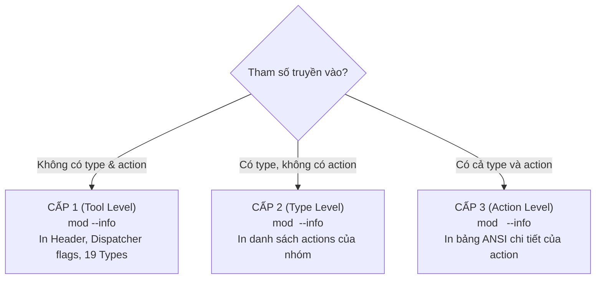

# 📖 Tài Liệu Chi Tiết Tính Năng `--info` Trong Mod CLI (`mod`)

Tài liệu này mô tả toàn diện kiến trúc kỹ thuật, luồng xử lý dữ liệu, thuật toán so khớp lệnh và cơ chế hiển thị định dạng đầu ra của tính năng **Self-Documenting CLI (`--info`)** trong hệ thống **Mod CLI (`mod`)**.

---

## 📑 Mục Lục
1. [Tổng Quan & Triết Lý Thiết Kế](#1-tổng-quan--triết-lý-thiết-kế)
2. [Cấu Trúc Catalog Dữ Liệu (`app_features.yml`)](#2-cấu-trúc-catalog-dữ-liệu-app_featuresyml)
3. [Cơ Chế Bóc Tách Cờ Sớm Tại Central Dispatcher (`src/main.py`)](#3-cơ-chế-bóc-tách-cờ-sớm-tại-central-dispatcher-srcmainpy)
4. [Cách In Ra Mô Tả Theo 3 Cấp Độ (3-Level Output)](#4-cách-in-ra-mô-tả-theo-3-cấp-độ-3-level-output)
   - [4.1. Cấp 1: Tra cứu Toàn Cục (`mod --info`)](#41-cấp-1-tra-cứu-toàn-cục-mod---info)
   - [4.2. Cấp 2: Tra cứu Cấp Nhóm Lệnh (`mod <type> --info`)](#42-cấp-2-tra-cứu-cấp-nhóm-lệnh-mod-type---info)
   - [4.3. Cấp 3: Tra cứu Cấp Hành Động Cụ Thể (`mod <type> <action> --info`)](#43-cấp-3-tra-cứu-cấp-hành-động-cụ-thể-mod-type-action---info)
5. [Động Cơ Hiển Thị & Bảng Màu ANSI (`_print_feature_description.py`)](#5-động-cơ-hiển-thị--bảng-màu-ansi-_print_feature_descriptionpy)
   - [5.1. Định dạng bảng ANSI chuẩn](#51-định-dạng-bảng-ansi-chuẩn)
   - [5.2. Hỗ trợ tài liệu Markdown mở rộng (`raw_file` / `raw_text`)](#52-hỗ-trợ-tài-liệu-markdown-mở-rộng-raw_file--raw_text)
   - [5.3. Xử lý cảnh báo an toàn (`Exit Code 0`)](#53-xử-lý-cảnh-báo-an-toàn-exit-code-0)
6. [Thuật Toán So Khớp Lệnh (`is_command_match`)](#6-thuật-toán-so-khớp-lệnh-is_command_match)
7. [Bảng Lệnh Mẫu Tra Cứu Thực Tế](#7-bảng-lệnh-mẫu-tra-cứu-thực-tế)
8. [Quy Chuẩn Đồng Bộ Khi Thêm Tính Năng Mới (Developer SOP)](#8-quy-chuẩn-đồng-bộ-khi-thêm-tính-năng-mới-developer-sop)

---

## 1. Tổng Quan & Triết Lý Thiết Kế

Trong các công cụ CLI tự động hóa đa năng, người dùng thường gặp khó khăn khi phải ghi nhớ nhiều cờ tùy chọn, định dạng tham số hoặc biến môi trường `.env`.

Tính năng **`--info`** được xây dựng theo triết lý **Self-Documenting CLI (Tự làm tài liệu)**:
* **Tra cứu nội dòng tức thì:** Cho phép xem hướng dẫn chi tiết của từng lệnh ngay trong terminal mà không cần mở trình duyệt hay đọc mã nguồn.
* **Chặn thực thi an toàn (Non-execution Guarantee):** Khi cờ `--info` xuất hiện, hệ thống **tuyệt đối không chạy logic nghiệp vụ** (không đồng bộ Google Drive, không tạo/xóa Gist, không gửi thông báo push).
* **Vị trí tự do (Position-Agnostic):** Cờ `--info` có thể đặt ở bất kỳ đâu trong câu lệnh (đầu, giữa các tham số, hoặc cuối cùng).
* **Tương thích ngược 100%:** Hỗ trợ alias `--des` ngầm cho các kịch bản hoặc thói quen cũ.

```mermaid
flowchart LR
    UserInput["mod <type> <action> [params] --info"] --> Dispatcher["Central Dispatcher (src/main.py)"]
    Dispatcher -->|Phát hiện --info / --des| Extractor["Bóc tách cmd_type & cmd_action"]
    Extractor --> Engine["Feature Description Engine (_print_feature_description.py)"]
    Engine --> Catalog[("src/contents/app_features.yml")]
    Catalog --> Formatter["Định Dạng ANSI Table / Raw Markdown"]
    Formatter --> Terminal["In ra Terminal & Exit(0)"]
```



---

## 2. Cấu Trúc Catalog Dữ Liệu (`app_features.yml`)

Dữ liệu mô tả tính năng được quản lý tập trung tại file YAML duy nhất:
📍 **[`src/contents/app_features.yml`](file:///d:/D-Documents/TOOLs/mod/src/contents/app_features.yml)**

### Cấu trúc Schema chuẩn:
```yaml
mod_tool:
  # 1. Danh sách các cờ điều phối toàn cục (Dispatcher Flags)
  dispatcher_flags:
    - flag: "--info"
      description: "In mô tả chi tiết command từ app_features.yml."
    - flag: "-a / --antigravity-IDE"
      description: "Dùng Antigravity IDE thay vì VSCode."

  # 2. Danh mục 19 nhóm lệnh (Types) và các hành động (Actions)
  types:
    - name: "notify"
      description: "Gửi thông báo qua đa kênh (ntfy, Telegram, Toast...)"
      actions:
        - id: "ACTION 58"
          title: "Gửi thông báo đa kênh"
          command: "mod notify send <message> | mod notify send"
          summary: "Gửi thông báo tới kênh chỉ định (mặc định ntfy app trên điện thoại)."
          details: "Gửi thông báo với nội dung <message>. Hỗ trợ cờ `--title <t>` (tiêu đề), `--channel <c>` (chọn kênh: ntfy, telegram, toast), `--topic <topic>` (topic ntfy, mặc định 'any-mod-automation-N3RT8P2L'), `--priority <p>` (min, low, default, high, urgent), `--tags <t>` (tags/emoji), `--url <u>` (liên kết click)."
          conditions: "Kênh ntfy không yêu cầu cấu hình thêm. Kênh telegram yêu cầu TELEGRAM_BOT_TOKEN và TELEGRAM_CHAT_ID trong .env."
```

### Các trường dữ liệu trong từng Action:
| Trường | Bắt buộc | Ý nghĩa |
| :--- | :---: | :--- |
| `id` | Có | Mã định danh chuẩn hóa (ví dụ: `ACTION 01`, `ACTION 50b`...). |
| `title` | Có | Tiêu đề tính năng ngắn gọn. |
| `command` | Có | Cú pháp câu lệnh mẫu (dùng `\|` để ngăn cách các alias). |
| `summary` | Có | Tóm tắt 1-2 câu về công dụng của lệnh. |
| `details` | Có | Giải thích sâu về cơ chế kỹ thuật và tham số. |
| `parameters` | Tùy chọn | Mô tả từng tham số vị trí (`<bắt_buộc>`, `[tùy_chọn]`). |
| `flags` | Tùy chọn | Mô tả các cờ tùy chọn bổ sung (ví dụ: `--channel`, `--topic`...). |
| `conditions` | Tùy chọn | Điều kiện tiên quyết (yêu cầu file, token, PATH...). |
| `raw_file` | Tùy chọn | Đường dẫn file Markdown mở rộng để in trực tiếp (nếu có). |
| `raw_text` | Tùy chọn | Khối văn bản thô đa dòng thay thế cho bảng ANSI. |

---

## 3. Cơ Chế Bóc Tách Cờ Sớm Tại Central Dispatcher (`src/main.py`)

Trong [`src/main.py`](file:///d:/D-Documents/TOOLs/mod/src/main.py), hàm `main()` tiến hành bóc tách cờ `--info` và `--des` ngay khi vừa nhận `sys.argv[1:]`:

```python
def main():
    raw_args = sys.argv[1:]

    # 1. Bóc tách Dispatcher Flags toàn cục trước
    info_flag = False
    antigravity_flag = False
    feature_args = []

    for arg in raw_args:
        if arg in ("--info", "--des"):
            info_flag = True
        elif arg in ("-a", "--antigravity-IDE"):
            antigravity_flag = True
        else:
            feature_args.append(arg)

    # 2. Xử lý khi không có tham số
    if not feature_args:
        if info_flag:
            print_feature_description(None, None)
        else:
            run_interactive_session(dispatch_command, print_help)
        sys.exit(0)

    # 3. Điều phối qua dispatch_command
    dispatch_command(feature_args, info_flag, antigravity_flag)
```

Trong `dispatch_command()`:
```python
def dispatch_command(
    feature_args: list[str],
    info_flag: bool = False,
    antigravity_flag: bool = False,
):
    # Trích xuất pos_args bất kể vị trí của flags
    if info_flag:
        pos_args = [a for a in feature_args if not a.startswith("-")]
        cmd_type = pos_args[0] if len(pos_args) > 0 else None
        cmd_action = pos_args[1] if len(pos_args) > 1 else None
        print_feature_description(cmd_type, cmd_action)
        sys.exit(0)
```

---

## 4. Cách In Ra Mô Tả Theo 3 Cấp Độ (3-Level Output)

Động cơ [`_print_feature_description.py`](file:///d:/D-Documents/TOOLs/mod/src/features/system/_print_feature_description.py) hỗ trợ tra cứu thông minh theo 3 cấp độ:



---

### 4.1. Cấp 1: Tra cứu Toàn Cục (`mod --info`)
* **Lệnh kích hoạt:** `mod --info` (hoặc `mod --des`)
* **Nội dung hiển thị:**
  1. Header biểu ngữ Mod CLI.
  2. Cú pháp chung và hướng dẫn vào chế độ tương tác.
  3. Bảng danh sách các cờ điều phối toàn cục (`dispatcher_flags`).
  4. Danh sách toàn bộ 19 nhóm lệnh (`Types`) kèm tóm tắt mục đích.
  5. Dòng gợi ý cú pháp tra cứu cấp sâu hơn.

#### Mẫu đầu ra trên Terminal:
```text
====================================================================
🚀 Mod CLI (mod) — Bộ Công Cụ Tự Động Hóa & Tiện Ích Đa Năng
====================================================================
+) Cú pháp chung: mod <type> <action> [tham_số...] [flags]
+) Chế độ tương tác: Chạy 'mod' không tham số để vào REPL + Tab Autocomplete.

Các cờ điều phối toàn cục (Dispatcher Flags):
  --info                 : In mô tả chi tiết command từ app_features.yml.
  -a / --antigravity-IDE : Dùng Antigravity IDE thay vì VSCode.

Danh sách nhóm lệnh (Types):
  open       : Mở trong System Explorer
  code       : Mở trong IDE
  compress   : Nén dự án hoặc thư mục tùy chỉnh
  edit       : Chỉnh sửa
  file       : Thao tác với file
  folder     : Thao tác với folder
  gdrive     : Thao tác với Google Drive qua rclone
  gist       : Quản lý CRUD & Kiểm toán dung lượng GitHub Gist
  git        : Thao tác Git
  init       : Khởi tạo máy tính
  mcp        : Quản lý MCP
  notify     : Gửi thông báo qua đa kênh (ntfy, Telegram, Toast...)
  print      : In thông tin
  proxy      : Kiểm tra Proxy
  py         : Python helpers
  run        : Thực thi script
  skill      : Quản lý AI Skills
  toast      : Thông báo Desktop Windows
  tunnel     : Cloudflare Tunnel Wrapper

💡 Tra cứu chi tiết: Gõ mod <type> --info hoặc mod <type> <action> --info
====================================================================
```

---

### 4.2. Cấp 2: Tra cứu Cấp Nhóm Lệnh (`mod <type> --info`)
* **Lệnh kích hoạt:** `mod notify --info`, `mod gdrive --info`, `mod file --info`...
* **Nội dung hiển thị:**
  - Header tiêu đề nhóm lệnh kèm mô tả nhóm.
  - Liệt kê toàn bộ các action thuộc nhóm: Tên tính năng kèm badge `[ACTION ID]`, Lệnh thực thi mẫu, Tóm tắt công dụng.
  - Gợi ý câu lệnh tra cứu chi tiết từng action (`mod <type> <action> --info`).
  - *(Đặc biệt: Nếu nhóm lệnh có `raw_file` như `mod gist --info` thì sẽ in toàn bộ file Markdown hướng dẫn).*

#### Mẫu đầu ra trên Terminal (Ví dụ `mod notify --info`):
```text
=== NHÓM LỆNH: NOTIFY (Gửi thông báo qua đa kênh (ntfy, Telegram, Toast...)) ===
──────────────────────────────────────────────────────────────────────
  • Gửi thông báo đa kênh [ACTION 58]
    Lệnh:    mod notify send <message> | mod notify send
    Tóm tắt: Gửi thông báo tới kênh chỉ định (mặc định ntfy app trên điện thoại).

  • Gửi thông báo kiểm tra (Ping Test) [ACTION 59]
    Lệnh:    mod notify test
    Tóm tắt: Gửi thông báo mẫu để kiểm tra kết nối và cấu hình của kênh thông báo.

  • Liệt kê các kênh thông báo hỗ trợ [ACTION 60]
    Lệnh:    mod notify channels
    Tóm tắt: Liệt kê danh sách các kênh thông báo hiện có kèm trạng thái cấu hình.

  • Xem hướng dẫn cấu hình kênh thông báo [ACTION 61]
    Lệnh:    mod notify config
    Tóm tắt: In hướng dẫn thiết lập app ntfy trên điện thoại và biến môi trường .env cho Telegram.

💡 Xem chi tiết từng lệnh: Gõ mod notify <action> --info
──────────────────────────────────────────────────────────────────────
```

---

### 4.3. Cấp 3: Tra cứu Cấp Hành Động Cụ Thể (`mod <type> <action> --info`)
* **Lệnh kích hoạt:** `mod notify send --info`, `mod gdrive sync --info`, `mod gist rate --info`...
* **Nội dung hiển thị:**
  - Tiêu đề tính năng kèm mã `[ACTION ID]`.
  - Cú pháp lệnh chính xác (`+) Lệnh:`).
  - Tóm tắt công dụng (`+) Tóm tắt:`).
  - Cơ chế kỹ thuật chi tiết (`+) Chi tiết:`).
  - Giải thích từng tham số bắt buộc / tùy chọn (`+) Tham số:`).
  - Danh sách cờ bổ sung (`+) Flags:`).
  - Yêu cầu môi trường & điều kiện tiên quyết (`+) Điều kiện:`).

#### Mẫu đầu ra trên Terminal (Ví dụ `mod notify send --info`):
```text
--- Tính năng: Gửi thông báo đa kênh [ACTION 58] ---
+) Lệnh:	mod notify send <message> | mod notify send
+) Tóm tắt:	Gửi thông báo tới kênh chỉ định (mặc định ntfy app trên điện thoại).
+) Chi tiết:	Gửi thông báo với nội dung <message>. Hỗ trợ cờ `--title <t>` (tiêu đề), `--channel <c>` (chọn kênh: ntfy, telegram, toast), `--topic <topic>` (topic ntfy, mặc định 'any-mod-automation-N3RT8P2L'), `--priority <p>` (min, low, default, high, urgent), `--tags <t>` (tags/emoji), `--url <u>` (liên kết click).
+) Điều kiện:	Kênh ntfy không yêu cầu cấu hình thêm (trừ khi dùng private topic có token). Kênh telegram yêu cầu TELEGRAM_BOT_TOKEN và TELEGRAM_CHAT_ID trong .env.
```

---

## 5. Động Cơ Hiển Thị & Bảng Màu ANSI (`_print_feature_description.py`)

### 5.1. Định dạng bảng ANSI chuẩn
Hàm `render_action_block(action: dict)` sử dụng bảng mã màu ANSI để định dạng thông tin trực quan:

| Mục hiển thị | Mã ANSI / Màu sắc | Ý nghĩa |
| :--- | :--- | :--- |
| **Tiêu đề tính năng** | `\033[96;1m` (Cyan Bold) | Nổi bật tiêu đề và ID tính năng. |
| **Nhãn `+) Lệnh / Tóm tắt / Chi tiết...`** | `\033[92;1m` (Green Bold) | Phân tách rõ ràng các đầu mục. |
| **Cú pháp lệnh** | `\033[93m` (Yellow) | Giúp người dùng dễ dàng copy/paste lệnh. |
| **Nội dung tóm tắt & tham số** | `\033[97m` (White) | Rõ ràng, dễ đọc trên nền terminal tối. |
| **Giải thích chi tiết & Điều kiện** | `\033[90m` (Dim / Gray) | Giảm độ chói cho các đoạn giải thích kỹ thuật dài. |

```python
def render_action_block(action: dict):
    title = action.get("title", "Không có tiêu đề")
    act_id = action.get("id", "")
    id_badge = f" [{act_id}]" if act_id else ""

    print()
    print(f"{CYAN_BOLD}--- Tính năng: {title}{id_badge} ---{RESET}")
    print(f"{GREEN_BOLD}+) Lệnh:{RESET}\t{YELLOW}{action.get('command', 'Không có')}{RESET}")
    print(f"{GREEN_BOLD}+) Tóm tắt:{RESET}\t{WHITE}{action.get('summary', 'Không có')}{RESET}")
    print(f"{GREEN_BOLD}+) Chi tiết:{RESET}\t{DIM}{action.get('details', 'Không có')}{RESET}")

    if action.get("parameters"):
        print(f"{GREEN_BOLD}+) Tham số:{RESET}\t{WHITE}{action.get('parameters')}{RESET}")
    if action.get("flags"):
        print(f"{GREEN_BOLD}+) Flags:{RESET}\t{WHITE}{action.get('flags')}{RESET}")
    if action.get("conditions"):
        print(f"{GREEN_BOLD}+) Điều kiện:{RESET}\t{DIM}{action.get('conditions')}{RESET}")
    print()
```

---

### 5.2. Hỗ trợ tài liệu Markdown mở rộng (`raw_file` / `raw_text`)
Đối với các tính năng có tài liệu tích hợp chuyên sâu (ví dụ GitHub Gist Manager), schema YAML cho phép khai báo trường `raw_file`:

```python
    raw_file = action.get("raw_file")
    if raw_file:
        candidate_paths = [
            Path(SRC_FOLDER) / raw_file,
            Path(PROJECT_ROOT) / raw_file,
            Path(raw_file),
        ]
        for cp in candidate_paths:
            if cp and cp.is_file():
                with open(cp, "r", encoding="utf-8", errors="replace") as f:
                    print(f"\n{f.read().strip()}\n")
                return True
```
Khi có `raw_file`, toàn bộ nội dung file Markdown sẽ được in trực tiếp ra terminal một cách nguyên vẹn.

---

### 5.3. Xử lý cảnh báo an toàn (`Exit Code 0`)
Nếu người dùng gõ nhầm một type hoặc action không tồn tại, hệ thống in cảnh báo thân thiện và **thoát với mã `0`** (`sys.exit(0)`) thay vì raise exception:

- Sai Action trong Type hợp lệ:
  ```text
  >>> Warn: Mặc dù loại lệnh 'notify' tồn tại nhưng không tìm thấy mô tả cho action 'unknown_act'.
  ```
- Sai Type hoàn toàn:
  ```text
  >>> Warn: Không tìm thấy nhóm lệnh 'unknown_type' trong tài liệu.
  ```

---

## 6. Thuật Toán So Khớp Lệnh (`is_command_match`)

Một lệnh trong catalog YAML có thể có nhiều cú pháp alias (ví dụ `mod notify send <msg> | mod notify send`). Hàm `is_command_match` xử lý so khớp thông minh như sau:

```python
def is_command_match(command_str: str, cmd_type: str, cmd_action: str | None) -> bool:
    if not command_str:
        return False

    sub_cmds = [c.strip() for c in command_str.split("|")]

    for sub_cmd in sub_cmds:
        tokens = sub_cmd.split()
        if tokens and tokens[0] == "mod":
            tokens = tokens[1:]

        yaml_type = tokens[0] if len(tokens) > 0 else None
        yaml_action = (
            tokens[1]
            if len(tokens) > 1
            and not tokens[1].startswith("<")
            and not tokens[1].startswith("[")
            and not tokens[1].startswith("-")
            else None
        )

        if cmd_action:
            if yaml_type == cmd_type and yaml_action == cmd_action:
                return True
            if f"mod {cmd_type} {cmd_action}" in sub_cmd:
                return True
        else:
            if yaml_type == cmd_type and yaml_action is None:
                return True

    return False
```

---

## 7. Bảng Lệnh Mẫu Tra Cứu Thực Tế

| Cấp độ tra cứu | Lệnh mẫu | Kết quả hiển thị |
| :--- | :--- | :--- |
| **Cấp 1 (Global)** | `mod --info` | Thông tin công cụ, danh sách dispatcher flags, danh mục 19 types |
| **Cấp 2 (Type Notify)** | `mod notify --info` | Tóm tắt các action: `send`, `test`, `channels`, `config` |
| **Cấp 2 (Type GDrive)** | `mod gdrive --info` | Tóm tắt các action: `sync`, `dl`, `list`, `link`... |
| **Cấp 2 (Type Gist)** | `mod gist --info` | In toàn bộ file Markdown `features/gist/README.md` (`raw_file`) |
| **Cấp 3 (Notify Send)** | `mod notify send --info` | Chi tiết cờ `--title`, `--channel`, `--topic`, `--priority` |
| **Cấp 3 (GDrive Sync)** | `mod gdrive sync --info` | Chi tiết đồng bộ rclone, tham số nguồn và đích |
| **Vị trí tự do (Position)**| `mod notify --info send "test"` | Tự động bóc tách và in chi tiết `send` an toàn |
| **Tương thích ngược** | `mod notify send --des` | Hoạt động hoàn toàn như `--info` |

---

## 8. Quy Chuẩn Đồng Bộ Khi Thêm Tính Năng Mới (Developer SOP)

Theo đúng quy chuẩn tại skill [`mod-cli-developer`](file:///d:/D-Documents/TOOLs/mod/.agent/skills/mod-cli-developer/SKILL.md), mỗi khi phát triển một tính năng mới (`Action`), bạn **BẮT BUỘC** phải thực hiện 4 bước sau để bảo đảm tính năng `--info` hoạt động chính xác:

1. **Bước 1 — Khai báo vào [`src/contents/app_features.yml`](file:///d:/D-Documents/TOOLs/mod/src/contents/app_features.yml):**
   * Tìm đúng `type` tương ứng (hoặc thêm type mới).
   * Tạo block action đầy đủ: `id`, `title`, `command`, `summary`, `details`, `parameters`, `flags`, `conditions`.
2. **Bước 2 — Cập nhật [`src/contents/help.txt`](file:///d:/D-Documents/TOOLs/mod/src/contents/help.txt):**
   * Thêm dòng hướng dẫn ngắn gọn cho action mới.
3. **Bước 3 — Cập nhật [`src/utils/interactive_cli.py`](file:///d:/D-Documents/TOOLs/mod/src/utils/interactive_cli.py):**
   * Khai báo action vào mảng của type trong `TYPE_ACTION_MAP` (luôn **sắp xếp theo thứ tự A-Z**).
4. **Bước 4 — Kiểm thử tra cứu `--info`:**
   ```powershell
   # Kiểm tra tra cứu nhóm type
   python src/main.py <type> --info

   # Kiểm tra tra cứu action vừa thêm
   python src/main.py <type> <new_action> --info
   ```
